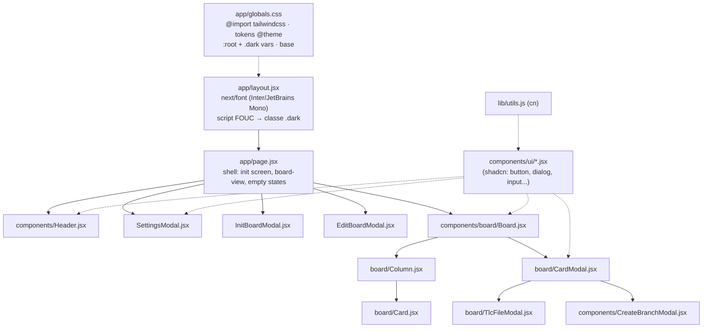

# UI Tailwind + shadcn/ui Migration — Design

**Spec**: `.specs/features/ui-tailwind-shadcn/spec.md`
**Status**: Draft (aguardando aprovação)

---

## Research Findings (verificado em 2026-06-11)

Fontes: docs oficiais via web (Context7 indisponível na sessão).

| Fato | Fonte |
| --- | --- |
| Tailwind v4.3 atual. Install: `npm i tailwindcss @tailwindcss/postcss postcss` + `postcss.config.mjs` com plugin `@tailwindcss/postcss` + `@import "tailwindcss"` no CSS. Sem `tailwind.config` | tailwindcss.com/docs/installation/framework-guides/nextjs |
| shadcn suporta JavaScript: `components.json` com `"tsx": false` gera `.jsx` | ui.shadcn.com/docs/components-json |
| Style `"new-york"` é o único válido (`default` deprecated). `style` e `tailwind.baseColor` imutáveis pós-init | ui.shadcn.com/docs/components-json |
| Para Tailwind v4: `tailwind.config` em branco no components.json | ui.shadcn.com/docs/components-json |
| Init em projeto existente: requer Tailwind configurado + alias `@/*`; `npx shadcn@latest init` depois `npx shadcn@latest add <comp>` | ui.shadcn.com/docs/installation/next |

**Incerteza flagada**: sintaxe `@plugin "@tailwindcss/typography";` para o plugin typography no v4 — alta confiança, mas validar na execução (T2). Se falhar, alternativa: estilos de markdown em `@layer components` (port do CSS atual).

---

## Architecture Overview

Coexistência incremental: Tailwind entra por cima do CSS legado; componentes migram um a um (cada um para de usar classes legadas); purge final remove o CSS morto.



**Nota estrutural**: `Board.jsx` (1.066 linhas, 6 componentes internos) será dividido em `components/board/` ANTES da restilização — destrava migração paralela por arquivo.

---

## Code Reuse Analysis

### Existing Components to Leverage

| Component | Location | How to Use |
| --- | --- | --- |
| Alias `@/*` | `web/jsconfig.json` | Já existe — requisito do shadcn atendido |
| Script anti-FOUC + toggle de tema | `app/layout.jsx` + `page.jsx` | Adaptar: `data-theme` → classe `.dark` (mesma mecânica, localStorage `theme` mantido) |
| Pipeline markdown | `react-markdown` + `remark-gfm` + `rehype-highlight` em Board.jsx | Intocado; só wrapper muda para `prose` |
| `highlight.js/styles/github-dark.css` | import em Board.jsx | Mantido |
| `GH_COLORS` map | Board.jsx | Mantido como fonte JS dos acentos de coluna (cores vêm da API GitHub) |
| Toda lógica de estado/fetch/polling | page.jsx, Board.jsx, modais | Intocada — migração é só de markup/estilo |
| `lib/boardSlug.js` | `web/lib/` | Intocado |

### Integration Points

| System | Integration Method |
| --- | --- |
| Build npm package | `scripts/build.mjs`: `next build` (export) → copia `web/out` → `dist/web`. Tailwind é build-time only — zero impacto |
| Dev proxy | `next.config.mjs` rewrites `/api` → `:5522`. Sem mudança |
| Static export | `output: "export"` + `distDir: "out"`. PostCSS roda no build; sem runtime deps |

---

## Components

### Foundation: PostCSS + Tailwind v4

- **Purpose**: habilitar Tailwind no build do Next
- **Location**: `web/postcss.config.mjs` (novo), `web/package.json` (deps)
- **Interfaces**: `@import "tailwindcss"` no topo de `globals.css`; CSS legado permanece abaixo durante a migração
- **Dependencies**: `tailwindcss`, `@tailwindcss/postcss`, `postcss`
- **Reuses**: build Next existente (webpack/PostCSS, dev e export)

### Foundation: shadcn init + tokens

- **Purpose**: design system base — components.json, `lib/utils.js` (cn), tokens CSS
- **Location**: `web/components.json`, `web/lib/utils.js`, `web/app/globals.css`
- **Interfaces**: `components.json`: `style: "new-york"`, `tsx: false`, `rsc: true`, `tailwind.config: ""`, `tailwind.css: "app/globals.css"`, `baseColor: "neutral"`, `cssVariables: true`, aliases `@/components`, `@/lib`, `@/components/ui`
- **Dependencies**: CLI `npx shadcn@latest init`; traz `clsx`, `tailwind-merge`, `class-variance-authority`, `lucide-react`, `tw-animate-css` (gerenciados pelo CLI)
- **Reuses**: alias `@/*` do jsconfig

**Modelo de tokens** (em `globals.css`):

```css
@import "tailwindcss";
/* tw-animate-css + typography via @plugin/@import conforme CLI gerar */
@custom-variant dark (&:is(.dark *));

:root { /* tokens shadcn light: --background, --foreground, --card, --primary, ... */ }
.dark { /* tokens shadcn dark */ }

@theme inline {
  /* mapeamento shadcn (--color-background: var(--background); ...) */
  /* tokens semânticos do domínio (geram utilities text-state-started etc.): */
  --color-state-triage: ...;    --color-state-backlog: ...;
  --color-state-unstarted: ...; --color-state-started: ...;
  --color-state-completed: ...; --color-state-cancelled: ...;
  --color-priority-urgent: ...; --color-priority-high: ...;
  --color-priority-medium: ...; --color-priority-low: ...;
  --font-sans: var(--font-inter);  --font-mono: var(--font-jetbrains-mono);
}
```

Cores semânticas: redefinidas em `:root`/`.dark` para manter contraste nos dois temas (equivalente ao bloco `[data-theme="light"]` atual).

### Foundation: layout + fontes + tema

- **Purpose**: fontes otimizadas e dark mode por classe
- **Location**: `web/app/layout.jsx`
- **Interfaces**: `next/font/google` → `Inter` (`--font-inter`) e `JetBrains_Mono` (`--font-jetbrains-mono`) nas classes do `<html>`; script inline FOUC passa a setar `classList.add('dark')` quando `localStorage.theme !== 'light'`
- **Dependencies**: T2 (vars de fonte consumidas no `@theme`)
- **Reuses**: script FOUC e `suppressHydrationWarning` existentes

### Foundation: shadcn primitives

- **Purpose**: blocos de UI usados pelas superfícies
- **Location**: `web/components/ui/*.jsx`
- **Interfaces**: `alert`, `badge`, `button`, `card`, `checkbox`, `dialog`, `input`, `label`, `select`, `separator`, `skeleton`, `tabs`, `textarea`, `tooltip`
- **Dependencies**: shadcn init; pacotes Radix por componente (CLI resolve)
- **Reuses**: —

### Superfícies (migração por arquivo)

| Superfície | Location | Primitives usados |
| --- | --- | --- |
| Header (topbar, board tabs, botões tema/settings/+) | `components/Header.jsx` | Button (ghost/outline, size icon), Separator, Tooltip, lucide (Sun, Moon, Settings, Plus, X) |
| Shell (init screen, board-view header, empty state) | `app/page.jsx` | Button, Skeleton, lucide (Pencil, Trash2) |
| Board container + Column | `components/board/Board.jsx`, `board/Column.jsx` | Badge (count), Button ghost icon (refresh), Skeleton (loading), Alert (erro) |
| Card | `board/Card.jsx` | Badge (PR, labels via inline style), utilities (border-l de prioridade, hover shadow, running dot) |
| CardModal | `board/CardModal.jsx` | Dialog, Button, Badge, Separator, prose (markdown), lucide (GitBranch, Play, Zap, RotateCcw, Copy, Check, Brush) |
| TlcFileModal | `board/TlcFileModal.jsx` | Dialog, Tabs (Editar/Preview), Textarea, Button, prose |
| SettingsModal | `components/SettingsModal.jsx` | Dialog, Input, Select, Label, Card (integrações), Badge (status), Button |
| InitBoardModal | `components/InitBoardModal.jsx` | Dialog, lista selecionável (utilities), Alert (scope error), Button, Input |
| EditBoardModal | `components/EditBoardModal.jsx` | Dialog, Checkbox+Label, drag nativo mantido (utilities p/ drag-over), Button |
| CreateBranchModal | `components/CreateBranchModal.jsx` | Dialog, Input, lista selecionável, Button |

### Mapeamento classes legadas → novo (referência para execução)

| Legado (globals.css) | Novo |
| --- | --- |
| `.backdrop` + `.modal*` | `Dialog`/`DialogContent` (overlay, foco, Esc, scroll-lock nativos Radix) |
| `.btn-primary` / `.btn-secondary` | `Button` default / `variant="secondary"` |
| `.btn-theme`, `.btn-settings`, `.btn-init-board`, `.btn-edit-board`, `.btn-delete-board-data`, `.modal-close`, `.cmd-copy`, `.btn-browse`, `.trigger-reset`, `.btn-col-remove`, `.col-refresh-btn`, `.scope-copy-btn`, `.tlc-file-close` | `Button variant="ghost"|"outline" size="icon"` + ícone lucide |
| `.sf-input`, `.path-input`, `.sf-input-number` | `Input` (number: utilities `tabular-nums`) |
| `select.sf-input` | `Select` |
| `.sf-checkgrid` / `.sf-check` | `Checkbox` + `Label` em container com overflow |
| `.tlc-tabs` / `.tlc-tab` | `Tabs` |
| `.board-tabs` / `.board-tab` | custom nav com utilities (é navegação com botão de fechar, não content-switcher — Radix Tabs não se aplica) |
| `.priority-badge`, `.modal-state-chip`, `.card-type-badge`, `.col-count`, `.intg-badge`, `.sf-chip`, `.chip-*`, `.col-act-badge` | `Badge` variants + tokens semânticos |
| `.label-chip` (cor da API GH) | `Badge` com inline style (bg `#hex22`, border `#hex55`, texto `#hex`) — não tokenizável |
| `.loader`, `.col-loader*` | `Skeleton` (cards fantasma na coluna) |
| `.card` (kanban) | div utilities: `border-l-[3px]` prioridade, hover `shadow-md` + `-translate-y-px` |
| `.card-modal-body.md` (~150 linhas) | plugin typography: `prose prose-sm dark:prose-invert` + ajustes pontuais |
| `.error-bar`, `.scope-error` | `Alert variant="destructive"` |
| `.sf-label`, `.sf-section-title`, `.sidebar-label` | `Label` / utilities `text-xs uppercase tracking-wider text-muted-foreground` |
| `.trigger-item*`, `.trigger-action-btn*`, `.tlc-output-btn*`, `.git-cmd*` | `Button variant="outline" size="sm"` full-width + `cn()` para estados done/error/running |
| `.intg-card`, `.modal-meta`, `.worktree-info`, `.board-repo-info`, `.cb-repo-chip` | `Card` ou div utilities `bg-muted/50 border rounded-lg` |
| scrollbar fina webkit | mantida como CSS custom (exceção documentada em globals) |
| keyframes `card-pulse`, `spin`, `pulse` | `--animate-*` custom no `@theme` (dialog usa tw-animate-css) |

---

## Data Models

N/A — feature sem mudança de dados.

---

## Error Handling Strategy (riscos da migração)

| Risco | Mitigação | Impacto se ocorrer |
| --- | --- | --- |
| Preflight v4 reseta estilos de superfícies ainda legadas (coexistência) | CSS legado define cores/bordas explicitamente (risco baixo); QA visual rápido após T1; ordem: `@import "tailwindcss"` antes do legado | Glitch visual temporário em superfície não migrada |
| `shadcn init` reescreve/injeta em `globals.css` existente | Rodar init cedo (T2), revisar diff antes de commit, reposicionar legado abaixo dos tokens | CSS legado deslocado; corrigível no diff |
| Radix Dialog muda comportamento (foco, Esc, scroll-lock) vs handlers manuais | Remover `useEffect` de Esc/`body.overflow` ao migrar cada modal; testar Esc em dialogs aninhados (CardModal→TlcFileModal: Radix fecha só o do topo) | Esc fechando modal errado; coberto no checklist |
| Componentes shadcn gerados como `.tsx` apesar de `tsx: false` | Conferir extensão após `add`; converter manualmente se preciso | Build falha (projeto sem TS) — detectado no gate |
| Tasks paralelas conflitando em `globals.css` | Regra dura: tasks de superfície NÃO editam `globals.css`; classes legadas ficam mortas até o purge (T16) | Conflito de merge entre sub-agents |
| `@plugin "@tailwindcss/typography"` incompatível | Validar em T2; fallback: port do CSS `.md` atual em `@layer components` | Markdown sem estilo até fallback |
| Export estático quebra | Gate T17: `npm run build` raiz + checagem `dist/web/index.html` | Publicação npm quebrada — bloqueante, por isso gate |

---

## Tech Decisions (only non-obvious ones)

| Decision | Choice | Rationale |
| --- | --- | --- |
| Versão Tailwind | v4 (atual, 4.3) | CSS-first, zero config, é o caminho do shadcn hoje |
| Linguagem | Manter JavaScript (`tsx: false`) | Migração TS é ortogonal e dobraria o escopo; suportado oficialmente |
| Style/baseColor | `new-york` / `neutral` | Únicos defaults vivos; neutral aproxima do visual GitHub-dark atual; imutáveis pós-init — decidir agora |
| Identidade visual | Adotar tokens shadcn (neutral) p/ superfícies; preservar cores semânticas de estado/prioridade como tokens custom | Usuário quer o look shadcn; semântica de kanban (verde=done etc.) não pode se perder |
| Dark mode | Classe `.dark` + adaptação do script FOUC atual; **sem next-themes** | Mecanismo atual funciona e é dependency-free; só troca atributo por classe |
| Estratégia de migração | Coexistência incremental + purge final (big-bang descartado) | 11 superfícies; big-bang = PR gigante sem checkpoint verificável |
| Split do Board.jsx | Dividir em `components/board/` antes de restilizar | 6 componentes num arquivo bloqueiam paralelismo e inflam tasks |
| Ícones | `lucide-react` substitui unicode/emoji funcionais; logo 🌸 fica | Vem com shadcn; consistência visual; emoji de logo é identidade |
| Cores de label GH | Continuam inline style | Vêm da API em runtime — impossível tokenizar |
| Tabs do topbar | Custom utilities (não Radix Tabs) | São navegação com botão fechar por aba; Radix Tabs é content-switcher controlado |
| Markdown | `@tailwindcss/typography` | Mata ~150 linhas de CSS custom; padrão do ecossistema |
